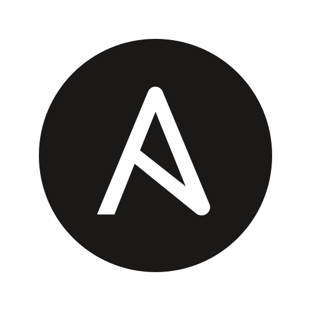
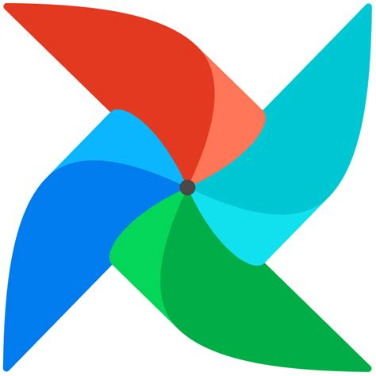

## Hello there 👋

I'm Mike. I like building infrastructure and infrastructure teams. In my new gig, I get to
build instrastructure for data.

I work at [NCSA](https://www.ncsasports.org/) as a director of Data Engineering.

[Ancient Blog Here](https://mjladd.com).

 <a href="https://www.linkedin.com/in/mjladd">https://www.linkedin.com/in/mjladd</a> 

- 🔭 I build stuff with [Terraform](https://github.com/hashicorp/terraform) and [Ansible](https://github.com/ansible/ansible), and mostly live in [AWS](https://aws.amazoncom)
- 🎸 As a failed musician, I try to find time to [write music](https://soundcloud.com/mjladd).
- ✔ I live my life by endless checklists and markdown.
- airflow | redshift | dbt

## 2024 Goals

Learn a whole bunch of new stuff, and make a small dent in my exponentially growing TOREAD list.

    

## Tools

-  | Terraform
-  | Ansible
-  | Bash
-  | Github
-  | Airflow
